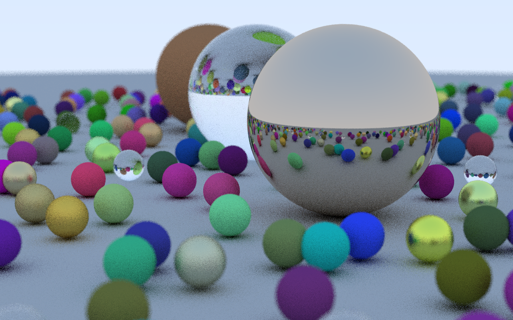
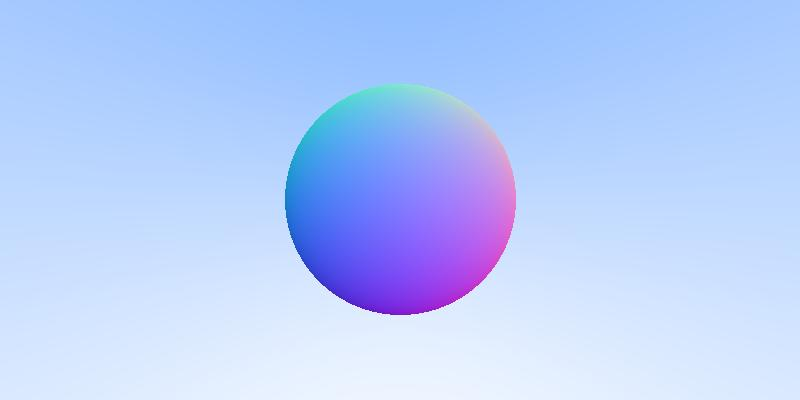
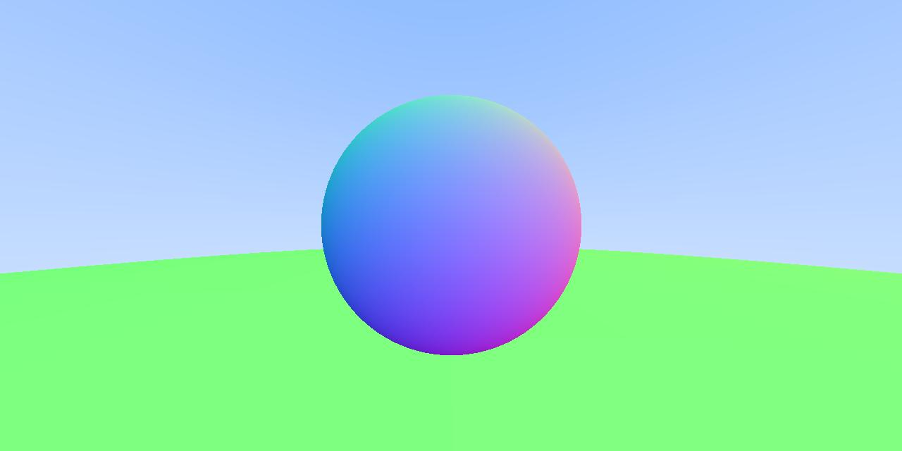
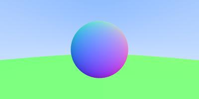
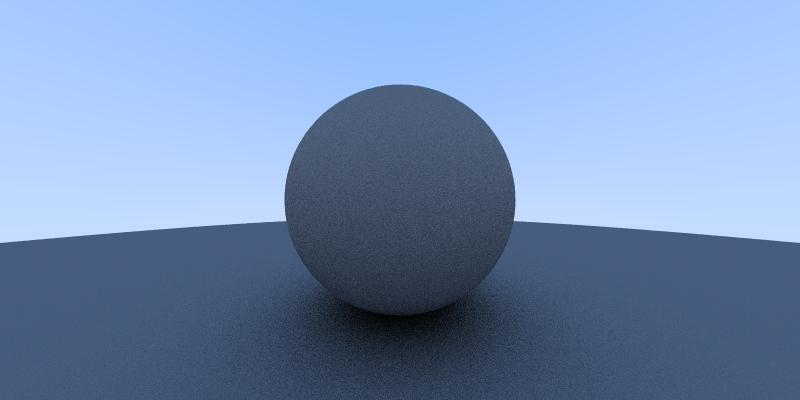
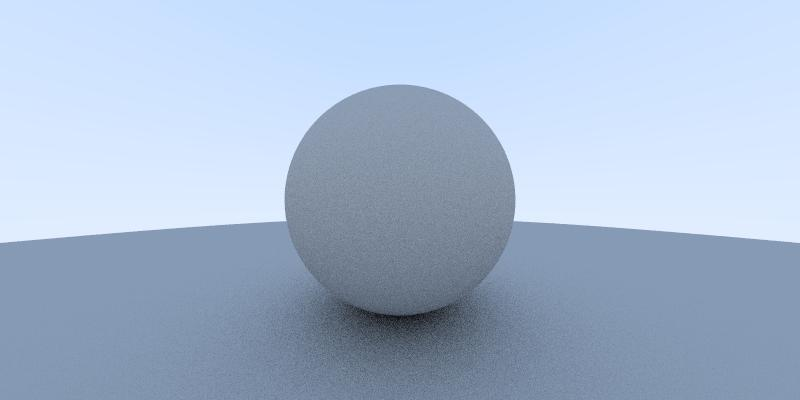
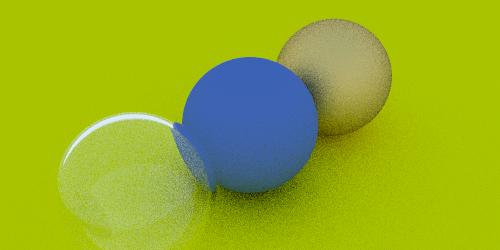
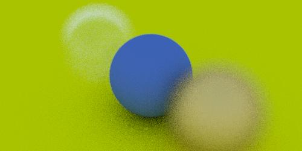
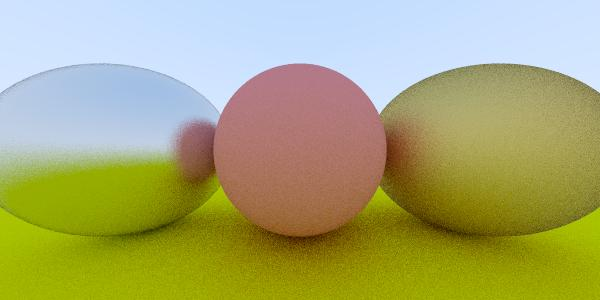

# raytraclj

I've been implementing the book [Ray Tracing in One Weekend](https://raytracing.github.io/books/RayTracingInOneWeekend.html) with **Clojure**

There's one branch by chapter, the final one is the **playing** branch which uses multi threading to speed things up.

The final scene takes around 35 minutes to render in 1280x800px.

Here are some samples:

